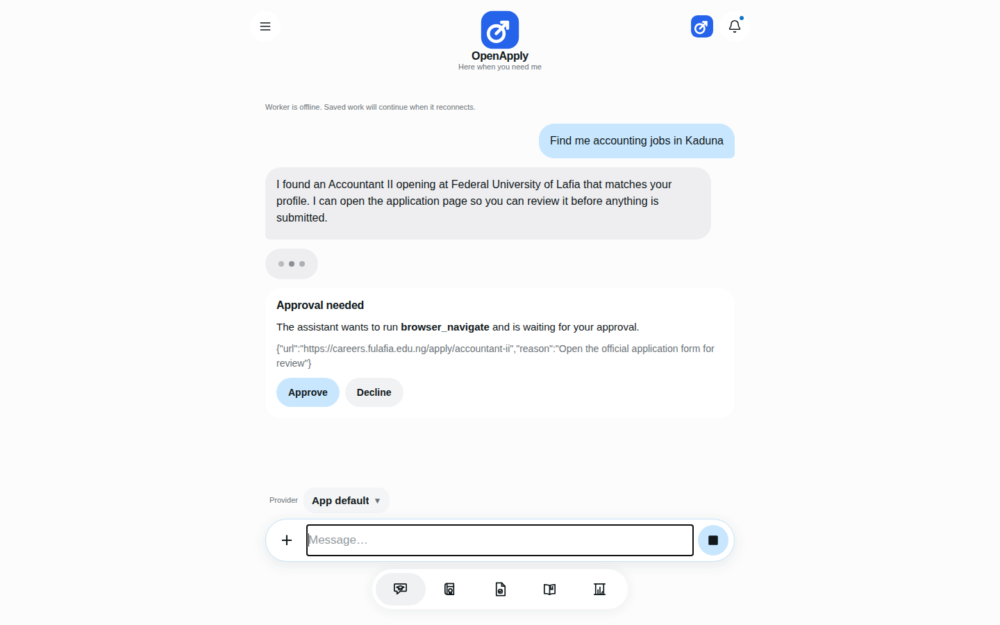
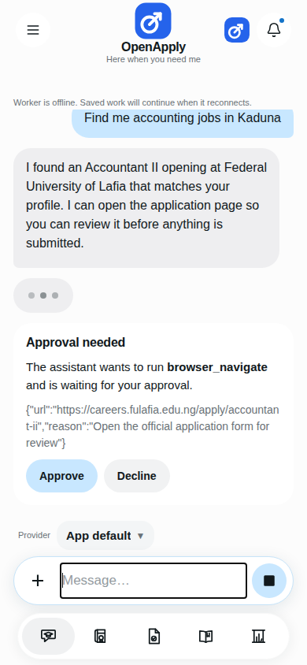
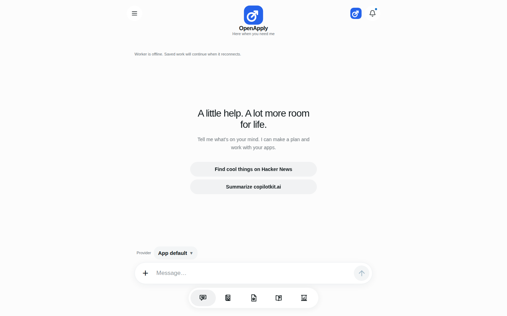
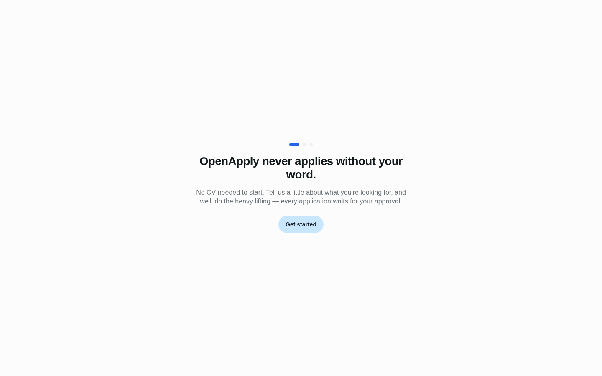
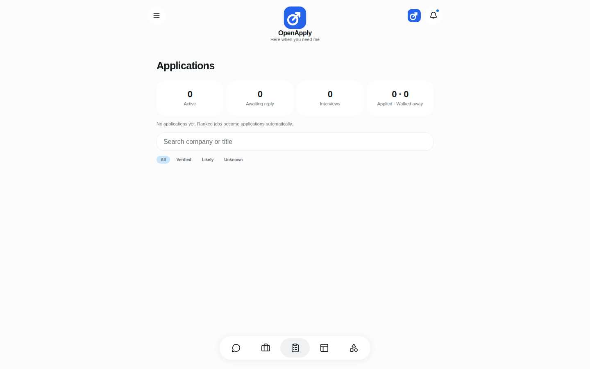
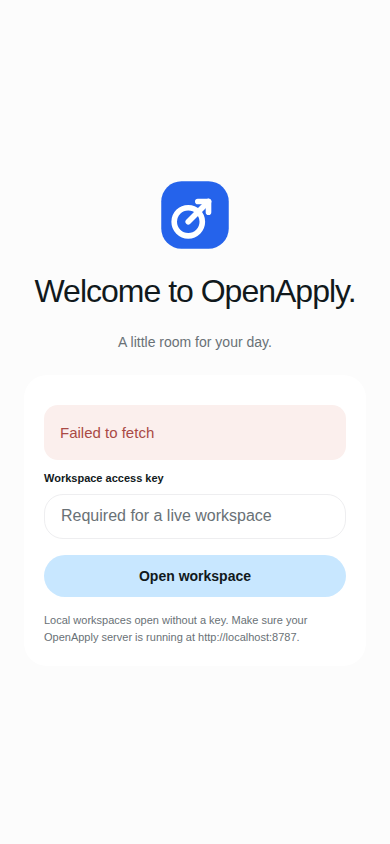
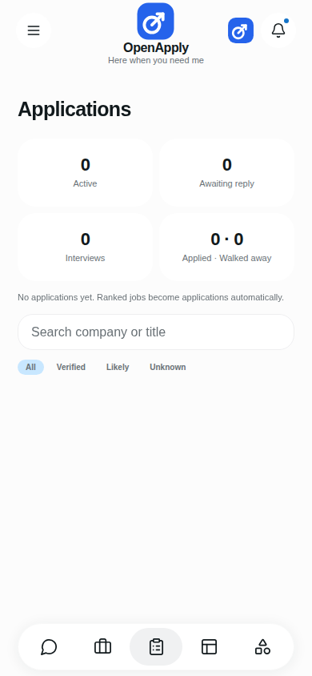
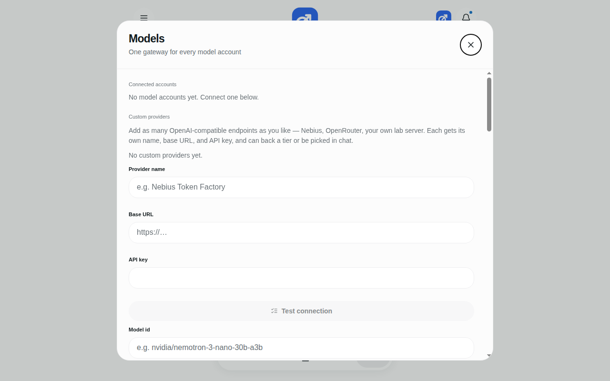

# OpenApply

**A job-application workspace that runs on your own machine.** It finds public jobs, drafts your resume and cover letter from your verified profile, and never submits anything without your approval.

## What is OpenApply?

Applying for jobs is repetitive, manual work: checking boards every day, tailoring resumes, filling the same forms over and over. OpenApply is an assistant that does the legwork while you stay in charge of every decision.

- **Finds jobs for you.** It scans public job boards (Greenhouse, Lever) on a schedule you control and ranks matches against your profile.
- **Drafts from evidence, not imagination.** Your resume, cover letter, and statements are built only from facts you've confirmed — certificates, transcripts, work history. It never invents qualifications.
- **Reviews like an HR manager.** Every application pack goes through an authenticity review before it reaches you.
- **You approve everything.** Drafts, browser actions, and submissions each wait for your explicit yes. You can take over the browser yourself at any time.
- **Your data stays local.** Threads, documents, and API keys live in your own install. Nothing is submitted, uploaded, or shared without you.

## Demo video

🎬 **Watch the demo** (54 seconds, narrated) — onboarding-free tour: chat, job scan, applications pipeline, and the human-approval card in action.


## Screenshots

Chat — the assistant asks for approval before acting (desktop and mobile):




Chat, empty state:



Dashboard and applications pipeline:






## Quick start

You need **Node.js 22+**, **pnpm**, and **git** on your computer. About ten minutes, most of it waiting on the install.

### 1. Get the code

Download the latest release archive and extract it, or clone the repository:

```bash
mkdir -p ~/openapply && cd ~/openapply
unzip ~/Downloads/openapply-v2-no-copilotkit.zip
```

### 2. Install dependencies

```bash
pnpm install --frozen-lockfile
```

### 3. Configure

```bash
cp .env.example .env
```

Open `.env` in any text editor. For a first look, the defaults are fine — the app starts in **sample mode** with fictional data and works with no API keys at all.

### 4. Start it (two terminals)

```bash
# Terminal 1 — the API server
pnpm dev
```

```bash
# Terminal 2 — the web app
pnpm dev:web
```

### 5. Open it

Go to **http://localhost:8081** in your browser — your workspace opens automatically. (A workspace access key is only needed when connecting to a remote or live server.)

Walk through: **Chat** → **Jobs** → **Applications** (bottom navigation). Try asking the chat to find you a role — when it wants to open a page, an approval card appears. Nothing happens until you tap **Approve**.

### 6. Connect a real model (optional)

Sample mode is great for exploring, but drafts need a real model. Open the **Apps** tab → **Models** and connect one of:



- An **API key** (OpenAI, Anthropic, xAI/Grok, Google/Gemini)
- **ChatGPT** or **Grok** via OAuth
- Any **OpenAI-compatible endpoint** as a custom provider (Nebius, OpenRouter, a lab server…)

Keys are stored encrypted in the local vault. They never leave your machine except to call the provider you chose.

## How it works

1. **Profile + evidence locker.** You confirm your details once: education, work history, certificates, transcripts. This is the only source of truth the AI may cite.
2. **Scheduled scans.** The hunter checks public boards for new postings and ranks them against your profile.
3. **Drafts.** Resume, cover letter, and statement specialists each draft from your confirmed evidence — one role per run, no invented facts.
4. **HR review.** An authenticity reviewer checks every pack against your evidence before you see it.
5. **Your approval.** You review the pack, approve or edit, and only then does anything get submitted — with you able to watch or take over the browser.

Unknown details become questions for you, never guesses in your documents.

## Contributing

Read [docs/CONTRIBUTING.md](docs/CONTRIBUTING.md) before opening a change. Behavior changes update the docs in the same pull request.

## License

OpenApply is licensed under the **GNU Affero General Public License v3.0** ([LICENSE](LICENSE)). If you modify OpenApply and run it on a network server, you must offer all users the Corresponding Source of your version.

OpenApply is a fork of [OpenMuse](https://github.com/CopilotKit/OpenMuse), whose code remains under its MIT license — see [LICENSE.upstream](LICENSE.upstream).
